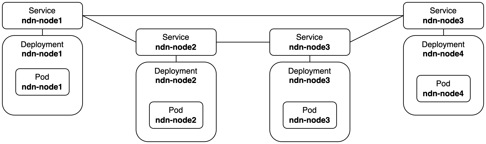

# nlsr-sample-k8s

## Overview
This repository provides a sample Kubernetes (K8s) deployment script for Named Data Networking (NDN) using NDN Link State Routing Protocol (NLSR).



## Deployment
1. Clone the repository and navigate to the project directory:
```bash
git clone https://github.com/hydrokhoos/nlsr-sample-k8s.git
cd nlsr-sample-k8s
```

2. Execute the deployment script:
```bash
./create.sh
```

3. Check NLSR status on a specific node:
```bash
kubectl exec deployment/ndn-node1 -- /bin/bash -c "nlsrc routing"
```
```plain text
Routing Table:
  Destination: /ndn/jp/%C1.Router/node4
    NextHop(Uri: tcp4://10.103.50.35:6363, Cost: 25)
    NextHop(Uri: tcp4://10.98.159.39:6363, Cost: 75)
  Destination: /ndn/jp/%C1.Router/node3
    NextHop(Uri: tcp4://10.103.50.35:6363, Cost: 50)
    NextHop(Uri: tcp4://10.98.159.39:6363, Cost: 50)
  Destination: /ndn/jp/%C1.Router/node2
    NextHop(Uri: tcp4://10.98.159.39:6363, Cost: 25)
    NextHop(Uri: tcp4://10.103.50.35:6363, Cost: 75)
```

## Provide Content
1. Create content (e.g. /sample.txt)
```bash
kubectl exec deployment/ndn-node1 -- /bin/bash -c "echo 'Hello, world!' > /sample.txt"
```

2. Advertise content using NLSR
```bash
kubectl exec deployment/ndn-node1 -- /bin/bash -c "nlsrc advertise /sample.txt"
```

3. Provide content
```bash
kubectl exec deployment/ndn-node1 -- /bin/bash -c "ndnputchunks /sample.txt < /sample.txt"
```

4. Request content from another node
```bash
kubectl exec deployment/ndn-node3 -- /bin/bash -c "ndncatchunks /sample.txt"
```
```plain text
All segments have been received.
Time elapsed: 0.000433459 seconds
Segments received: 1
Transferred size: 0.014 kB
Goodput: 258.386606 kbit/s
Congestion marks: 0 (caused 0 window decreases)
Timeouts: 0 (caused 0 window decreases)
Retransmitted segments: 0 (0%), skipped: 0
RTT min/avg/max = 0.394/0.394/0.394 ms
Hello, world!
```

## Undeploy
To delete the deployments and associated resources:
```bash
kubectl delete -f ndn-node1.yaml
kubectl delete -f ndn-node2.yaml
kubectl delete -f ndn-node3.yaml
kubectl delete -f ndn-node4.yaml
```
